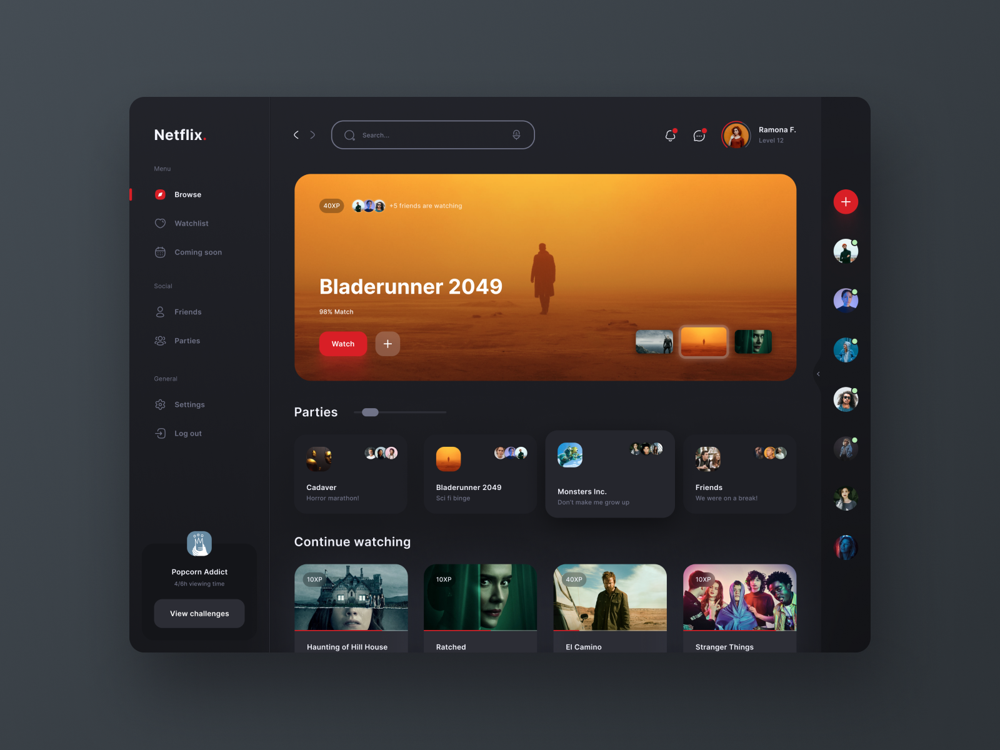

<h1 align="center"> Netflix Gamified </h1>

    Programa promovido por Isaías Ramos para o ensino de tecnologias.  

  <a href="#-tecnologias">Tecnologias</a>&nbsp;&nbsp;&nbsp;|&nbsp;&nbsp;&nbsp;
  <a href="#-layout">Layout</a>&nbsp;&nbsp;&nbsp;&nbsp;&nbsp;&nbsp;

 

  

## 🚀 Tecnologias

Esse projeto foi desenvolvido com as seguintes tecnologias:

- HTML e CSS
- JavaScript
- Git e Github

## 🔖 Layout

Você pode visualizar o autor da imagem através [DESSE LINK](https://dribbble.com/shots/15591899-Netflix-Gamified).

---

Functionalities

On the home screen, the movie banner is highlighted. On its interface, there is a "Watch" button and an "Add" button which is represented by the “+” sign. When you click on the "Add" button, a filling box opens to enter the URL of the film (which can be the address of an image of your choice) and the name of the film, series, anime or other content of your choice. When you create content, it appears on the home screen.
 
It is possible to see that three series were added: Adventure Time, To All the Boys I've Loved Before and Bridgerton. The first is highlighted, followed by To All the Boys I've Loved Before and, finally, Bridgerton. Additionally, the user can add more series if desired.

 

In the Party section, Cadaver, Blade Runner, Monsters Inc. and Friends cards are presented. By clicking on any one, you can get more information about it. The card selected as an example was Monsters Inc.

On the left side of the screen, Netflix online and offline members are displayed. Above all profiles, there is an add profiles button, represented by the "+" sign. When you click on it, a card opens that allows the user to create profiles. Just copy any image address of your choice and click "Create". Then a new online user will be displayed after the last member of the profiles.

Layout before the user
 
Layout after new user added
